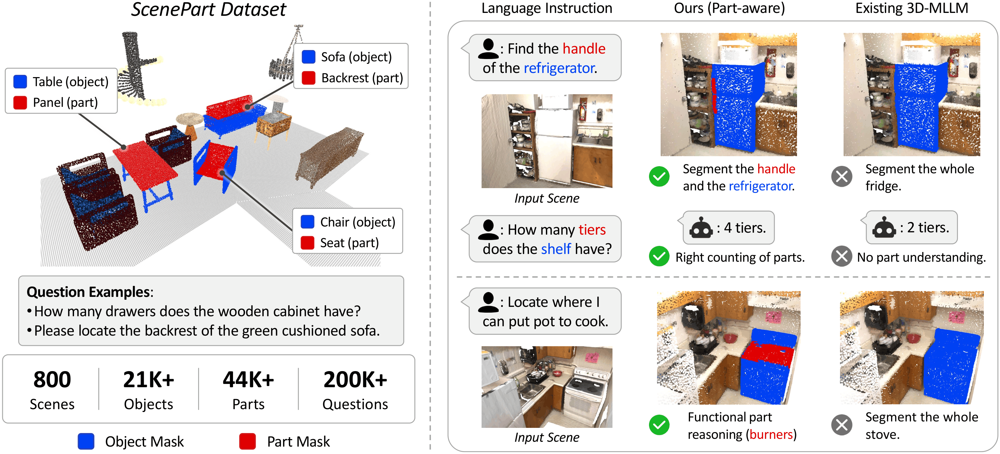
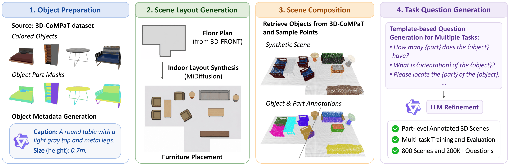

# PAR3D

**PAR3D: A Unified 3D-MLLM with Part-Aware Representation for Scene Understanding**

<a href="https://arxiv.org/abs/2606.06485"></a>

PAR3D is a unified part-aware 3D multimodal large language model for fine-grained 3D scene understanding. It supports understanding, reasoning, and grounding over both whole objects and their semantic parts in 3D scenes.

Project page: [https://atrovast.github.io/PAR3D/](https://atrovast.github.io/PAR3D/)

## Overview

PAR3D extends unified 3D-MLLMs from object-level understanding to part-aware scene understanding.

- Understand both objects and their fine-grained parts in 3D scenes.
- Support question answering, segmentation, and reasoning in a unified framework.
- Introduce **ScenePart**, a synthetic 3D scene dataset with part-level annotations and language instructions.

## Teaser



## ScenePart Dataset



ScenePart provides object masks, part masks, object-part correspondences, and language-task annotations for part-aware 3D scene understanding.

## Coming Soon

- Code release
- Dataset release
- Training and evaluation instructions
- Checkpoints and pretrained models

## Citation

If you find this project useful, please consider citing:

```bibtex
@article{dai2026par3d,
  title={PAR3D: A Unified 3D-MLLM with Part-Aware Representation for Scene Understanding},
  author={Dai, Shaohui and Qu, Yansong and Shen, You and Zhang, Shengchuan and Cao, Liujuan},
  journal={arXiv preprint arXiv:2606.06485},
  year={2026}
}
```
